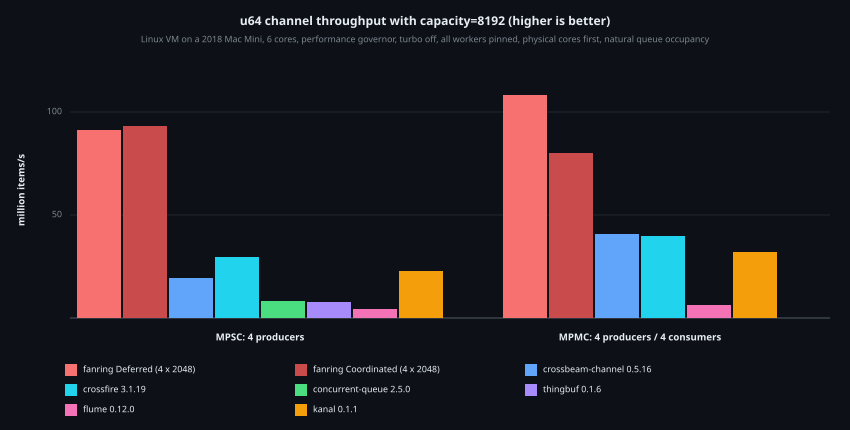
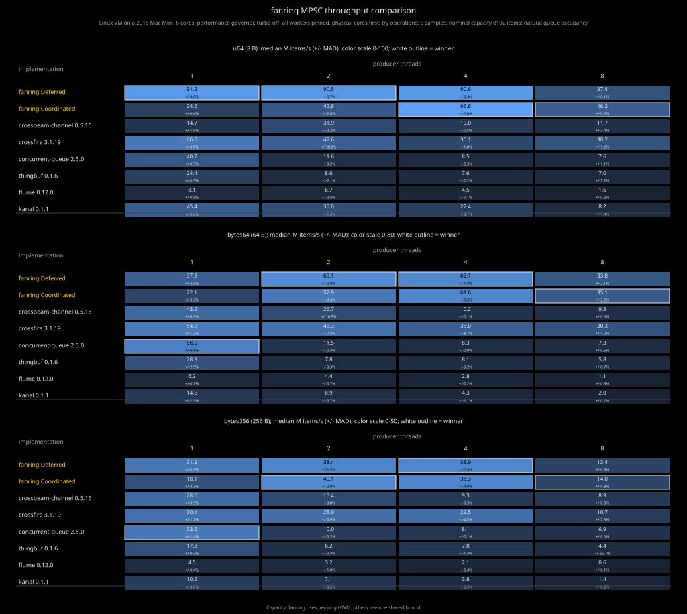
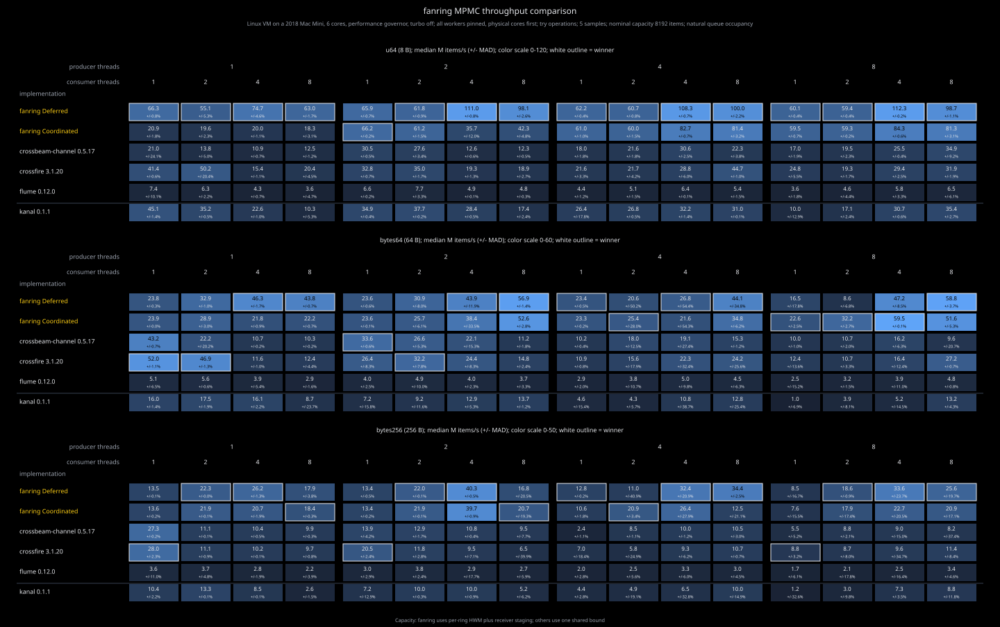
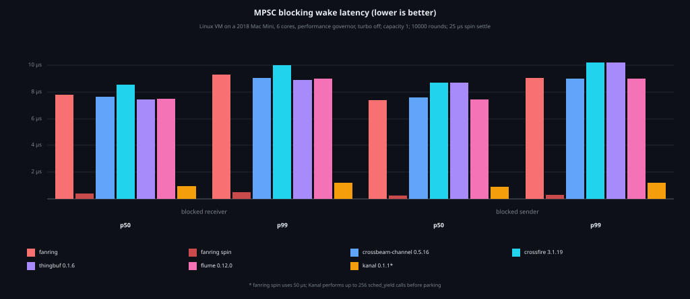
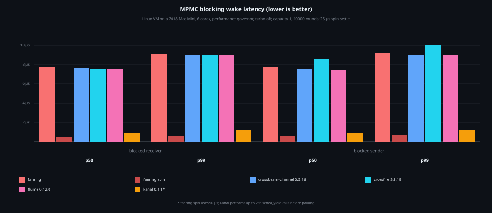
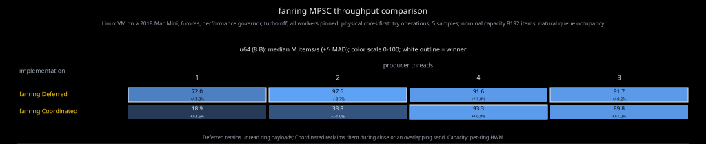
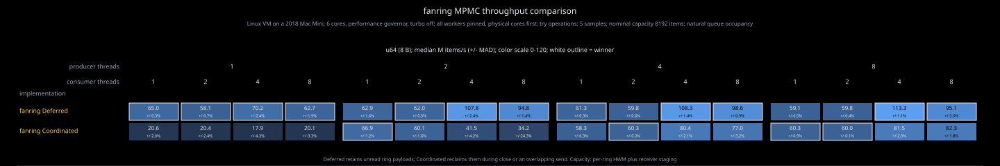
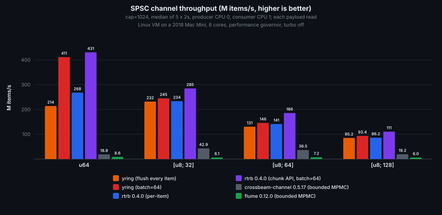

# Benchmarks

Measurements collected on 2026-10-06 from library sources at `31a8c5c`.
Dependency versions and benchmark source hashes are recorded in run provenance.
The charted values are medians of repeated samples.
Hardware and affinity are shown in each chart.

## Throughput

| Setting | MPSC and MPMC comparisons |
| --- | --- |
| Measurement | Five one-second samples per case |
| Warmup | 250 ms per implementation and configuration |
| Nominal capacity | 8192 items |
| Producers | 1, 2, 4, 8 |
| MPMC consumers | 1, 2, 4, 8 |
| Payloads | `u64`, 64 bytes, 256 bytes |
| Queue occupancy | Natural; nonblocking operations |
| Affinity | Workers pinned to CPUs 0-5; configurations with more workers share CPUs |

Implementation order rotates between samples. Every sample drains accepted
values and checks sent/received counts. Fanring capacity is per sender ring;
MPMC staging adds storage outside those bounds. The comparison channels use a
shared queue bound. Details are in [DEVELOPMENT.md](DEVELOPMENT.md#benchmarks).
Some MPMC cases have high sample variability; detail charts show their relative
median absolute deviation alongside median throughput.

### Summary

### MPSC

### MPMC

## Blocking wake latency

Capacity-one channels measure a blocked receiver woken by send and a blocked
sender woken by receive. Each direction has 10,000 rounds after 200 warmup
rounds, with a 25 microsecond active settling interval. Communicating threads
use distinct physical cores. The `fanring spin` series uses
`WaitStrategy::SpinFor` with a 50 microsecond budget.
Each channel has one bar per direction: solid fill reaches p50, with a
translucent extension to p99.

## Teardown policy throughput

These charts select the `u64` rows for `Deferred` and `Coordinated` from the
same throughput sweeps above. Each cell shows median throughput and relative
median absolute deviation. They measure steady traffic, including ordinary
draining.

[Teardown ownership](DESIGN.md#teardown-policies) describes the contracts.
[Reproduction commands](DEVELOPMENT.md#teardown-policy-comparisons) also run an
owned-payload probe against the dependency versions in `Cargo.lock`.

## SPSC measurements

The yring comparison uses five two-second samples per case after 250 ms warmup,
capacity 1024, and publication batches of 1 or 64. Producer and consumer threads
are pinned to CPUs 0 and 1. Every sample checks the complete sent/received count.
Implementation order rotates between samples. The chart includes all four
payload sizes and plots medians from cached JSONL rows.

Every consumer reads each payload through `std::hint::black_box`, including
both slices of each `rtrb` read chunk. Receive loops check the deadline once
per 1024 iterations. `yring` uses per-item pushes and pops; `rtrb chunked` writes
64 values at once and reads all available chunk values before releasing them.
The JSONL rows record payload handling and clock-check cadence so samples from
different workloads cannot be combined.

The harness appends raw rows to `~/.cache/yring/comparison.jsonl`. The generator
selects a complete run with matching configuration and distinct CPUs.
[Development commands](DEVELOPMENT.md#spsc-comparison) reproduce the benchmark
and chart; `--results` selects a different result file.

## Run records

This refresh's raw rows and source hashes are under
`/mnt/bench/tmp/fanring-refresh-20261006-1630/`. `provenance.json` records the
library sources, benchmark harness, dependency versions, and configuration.
The SPSC data is in
`spsc-comparison.jsonl`; throughput and latency data retain the usual
per-implementation JSONL layout.
