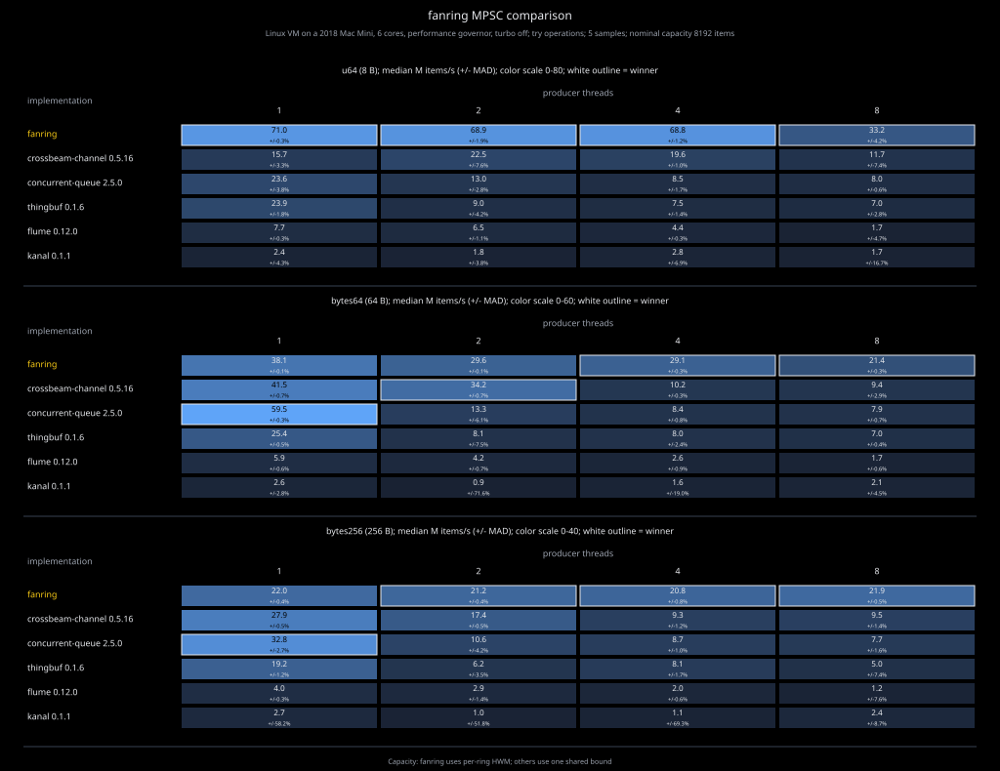

# fanring

Fast bounded MPSC channel built from one SPSC `yring` per producer.

Sender registration is dynamic. Each sender writes to its own ring. The
receiver drains active rings in bounded bursts. Producers do not contend on a
shared queue tail.



## Example

```rust
use fanring::channel;

let (mut tx0, mut rx) = channel(8);
let mut tx1 = tx0.try_clone().expect("receiver alive");

tx0.send("from sender 0").unwrap();
tx1.send("from sender 1").unwrap();

for _ in 0..2 {
    println!("{}", rx.recv().unwrap());
}

assert_eq!(tx0.send("still open"), Ok(()));
drop(rx);
assert_eq!(tx0.send("closed").unwrap_err().into_inner(), "closed");
```

## Contract

- Bounded MPSC with blocking, timeout, and non-blocking operations.
- No configured producer limit.
- One bounded SPSC ring per live sender.
- Capacity is per sender and rounded up to a power of two.
- `try_send` returns `Full` when that sender's ring is full.
- `try_recv` returns `Empty` when no active ring has visible data.
- `send` and `recv` park only after the corresponding try operation fails.
- Blocking operations spin briefly before parking.
- `send_timeout` and `recv_timeout` bound that parked wait.
- FIFO per sender. Relaxed ordering across senders.
- Active senders are served in bursts of at most 64 items.
- Dropped sender slots are reused after their rings drain.
- Receive-side yring prefetch and release batching is internal to `try_recv`.
- `unsafe` is forbidden in this crate. Ring storage is delegated to `yring`.

## Good Fit

- Many long-lived or frequently changing producers feeding one consumer.
- Per-producer FIFO is enough.
- Per-producer HWM matches the desired backpressure model.
- Callers can use built-in parking or own the backoff policy around `try_*`.

## Bad Fit

- Need multiple consumers from one channel.
- Need global FIFO or strict one-item round robin.
- Need one exact capacity shared across all producers.
- Need async wakeups.

More detail: [DESIGN.md](DESIGN.md)

## Benchmarks

```sh
cargo bench --bench comparison
FANRING_BENCH_MODE=blocking cargo bench --bench comparison
cargo bench --bench wake_latency
```

The comparison bench accepts `FANRING_BENCH_SECS`,
`FANRING_BENCH_PRODUCERS`, `FANRING_BENCH_CAPACITY`,
`FANRING_BENCH_PAYLOADS`, `FANRING_BENCH_IMPLS`, and
`FANRING_BENCH_OUT`. Wake latency accepts `FANRING_WAKE_ROUNDS`,
`FANRING_WAKE_WARMUP`, `FANRING_WAKE_SETTLE_NS`, and
`FANRING_WAKE_OUT`. Both append machine-readable JSONL.
