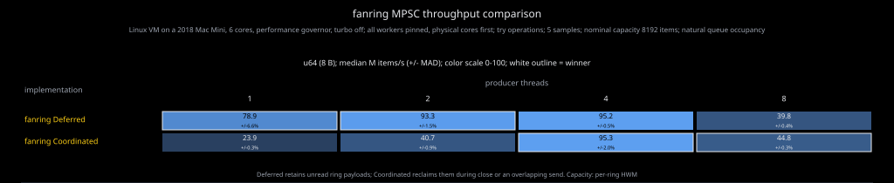
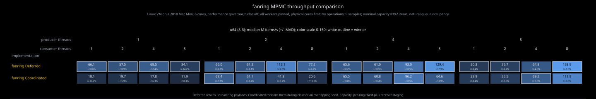

# Teardown policies

Fanring lets each channel choose when unread payloads are destroyed. The policy
is fixed at construction, included in the endpoint types, and inherited by
every cloned sender, newly registered lane, and cloned MPMC receiver.

| Policy | After the last receiver drops | Send cost |
|---|---|---|
| `Deferred` (default) | Unread ring values may remain until their sender releases the ring. Receiver-local staged values can drop earlier. | No cleanup ownership handshake. |
| `Coordinated` | Receiver drains unread values. An overlapping send owns any remaining cleanup and destroys late publications when it resumes. | Atomic ownership handshake around push/flush. |

Both policies disconnect senders and wake blocked sends. Neither requires the
application to stop producers before dropping a receiver. With Coordinated,
receiver teardown does not wait for a paused producer; cleanup of that
producer's late publication can outlive receiver drop. User destructors run
outside the cleanup mutex, on either the receiver or producer thread. A user
destructor can itself block or panic. Ring allocations remain alive while their
sender handles own them under either policy.

Dropping a non-last MPMC receiver preserves its queued work for the remaining
receivers under both policies. Dropping the last sender preserves buffered
messages for receivers to drain under both policies.

## Choosing a policy

Deferred suits plain numeric values, disposable telemetry, and channels whose
sender lifetimes already bound acceptable retention. Budget unread payloads
per sender lane, including allocations they own. A bounded number of slots
does not bound the bytes inside queued `Vec`s.

Choose Coordinated for messages containing reply senders, permits, or other
resources whose release must not depend on an idle sender being dropped:

```rust
use fanring::{mpsc, teardown::Coordinated};

let (mut tx, rx) = mpsc::channel_with_policy::<_, Coordinated>(4);
let (reply, response) = std::sync::mpsc::channel::<()>();
tx.try_send(reply).unwrap();
drop(rx);
assert_eq!(response.try_recv(), Err(std::sync::mpsc::TryRecvError::Disconnected));
drop(tx);
```

`mpmc::channel_with_policy` works the same way.
`try_channel_with_policy` validates capacity without panicking. Existing
`channel` and `try_channel` constructors select Deferred.

A successful send accepts a message into the channel; it does not acknowledge
application processing. Payload `Drop` is the cleanup mechanism under both
policies. Adding a custom destructor cannot make a retained payload drop sooner.
For example, a queued `oneshot::Sender` already has a cancellation destructor;
its lifetime determines when that destructor can notify the waiting caller.

## Measured throughput cost

These policy comparisons use `u64`, nonblocking operations, uncontrolled queue
occupancy, and an aggregate nominal ring capacity of 8192. Each cell shows the
median of five one-second samples and relative median absolute deviation.
Implementations alternate order between samples. They measure steady traffic,
including normal benchmark draining, rather than the latency of abandoning a
backlog. Owned-payload destruction is checked separately below.





The small-producer cases expose a substantial coordination cost. The charts
make that choice visible instead of presenting different guarantees as the same
operation. Reproduction commands are in [DEVELOPMENT.md](../DEVELOPMENT.md).

## Other channels: observed payload retention

Checked on 2026-09-08 with the versions pinned in this repository's `Cargo.lock`.
The probe queues four owned payloads, drops every receiver while keeping the
sender alive, checks destructor counts, then drops the sender. All four values
are destroyed exactly once after both endpoints are gone in every case.

| Channel/version | Values destroyed at receiver drop, sender alive |
|---|---:|
| fanring MPSC/MPMC Deferred | 0/4 |
| fanring MPSC/MPMC Coordinated | 4/4 |
| crossbeam-channel 0.5.16 bounded | 0/4 |
| crossbeam-channel 0.5.16 unbounded | 4/4 |
| crossfire 3.1.19 MPSC/MPMC, bounded/unbounded | 0/4 |
| flume 0.12.0, bounded/unbounded | 0/4 |
| kanal 0.1.1, bounded/unbounded | 0/4 |
| thingbuf 0.1.6 blocking MPSC | 0/4 |
| yring 0.3.16 SPSC | 0/4 |

Run `cargo run --locked --example teardown` to reproduce the table. These are
sequential observations, not promises about other libraries' APIs or concurrent
teardown progress. Retention is memory-safe, but can strand replies or permits
when their owners remain queued behind a surviving sender. `concurrent-queue`
is a standalone queue without receiver handles; its
[`close()`](https://docs.rs/concurrent-queue/2.5.0/concurrent_queue/struct.ConcurrentQueue.html#method.close)
preserves queued items for subsequent pops, so receiver-drop semantics do not apply.
The probe also checks it through two `Arc` owners: close the queue and drop one
owner, then drop the remaining owner.

| Queue/version | Values destroyed after close, one owner still alive | After last owner drops |
|---|---:|---:|
| concurrent-queue 2.5.0 bounded | 0/4 | 4/4 |
| concurrent-queue 2.5.0 unbounded | 0/4 | 4/4 |

Unlike a channel receiver drop, dropping one `Arc` alone does not close this
queue or prevent its remaining owners from pushing or popping.

Crossbeam has an exact request/reply deadlock report in
[#1102](https://github.com/crossbeam-rs/crossbeam/issues/1102). Its
[fix #1121](https://github.com/crossbeam-rs/crossbeam/pull/1121) merged on
2026-06-07, but is absent from released 0.5.17 and listed for 0.5.18 in the
[next-release preparation](https://github.com/crossbeam-rs/crossbeam/pull/1162).
That implementation waits for reserved slots to finish publishing during
receiver teardown. Crossbeam's existing unbounded cleanup also waits for
unfinished writes. Fanring Coordinated instead hands late cleanup to the
producer, allowing the receiver to finish without waiting for that producer.

Crossfire's [`send` documentation](https://docs.rs/crossfire/3.1.19/crossfire/struct.AsyncTx.html#method.send)
recommends payload `Drop` for sends accepted during receiver destruction, but
does not promise prompt destruction. No matching payload-retention issue was
found in its open/closed issues during this review;
[#15](https://github.com/frostyplanet/crossfire-rs/issues/15) concerns detecting
receiver disconnection rather than releasing queued payloads.
