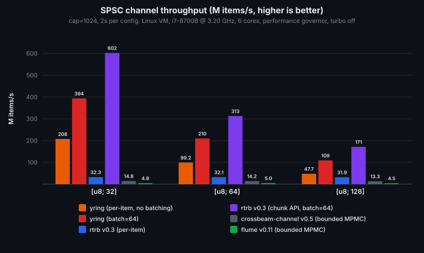

# yring

Bounded SPSC ring buffer with ypipe-style batched flush/prefetch.

## The problem

Existing Rust SPSC ring buffers (`rtrb`, `ringbuf`, `crossbeam`) do 1-2
atomic operations per item. At millions of items per second, those
atomics become the bottleneck.

## The solution

Separate writing from publication:

- `head`: consumer read position (AtomicUsize, consumer-owned)
- `cursor`: producer write position (plain usize, producer-private, no atomic)
- `tail`: last flushed position (AtomicUsize, producer writes / consumer reads)

`push()` writes without atomics while cached space remains. `flush()` makes all
pending writes visible with a single Release store. `prefetch()` loads
all available items with a single Acquire load. `pop()` reads with zero
atomics. `release()` publishes consumed slots back to the producer with
a single Release store. Result: atomic synchronization happens per
batch, not per item.

The speedup comes from caching positions and publishing batches. The
three-pointer description counts the producer's local cursor alongside two
shared atomic cursors. The consumer also keeps a local read position and
a cached publication boundary.

## Usage

```rust
let (mut producer, mut consumer) = yring::spsc(1024);

// Producer: push with zero atomics, flush once per batch
for i in 0..100 {
    producer.push(i).unwrap();
}
producer.flush(); // one Release store makes all 100 items visible

// Consumer: prefetch with one Acquire load, pop with zero atomics
consumer.prefetch(); // one Acquire load
while let Some(val) = consumer.pop() {
    // process val
}
consumer.release(); // one Release store frees slots for producer
```

## Sharing the producer handle

`Producer` needs `&mut self` for writes. To write through a handle stored in
an `Arc`, wrap it in `ProducerOwner`:

```rust
use std::sync::Arc;

let (producer, mut consumer) = yring::spsc(1024);
let producer = Arc::new(yring::ProducerOwner::new(producer));

let producer_thread = producer.clone();
std::thread::spawn(move || {
    producer_thread.push(42).unwrap();
    producer_thread.flush();
})
.join()
.unwrap();

consumer.prefetch();
assert_eq!(consumer.pop(), Some(42));
consumer.release();
```

`ProducerOwner` preserves the producer's non-atomic cursor while allowing the
handle itself to be shared. The first producer call binds it to the current
thread. Later calls from another thread panic. Multiple owners are fine, but
all producer calls must come from the same thread. For producer access from
multiple threads, use a channel with a multi-producer API instead.
Thread tokens never wrap: allocation panics if the token range is exhausted.

The key advantage over chunk-based batching APIs (like `rtrb`'s
`write_chunk_uninit`): you keep the simple per-item `push()`/`pop()`
API. No upfront batch size, no slice management, no restructuring your
code. Push items one at a time, flush when you're ready.

## Backpressure

`push()` returns `Err(val)` when the ring is full. `pop()` returns
`None` when the prefetched window is exhausted. Neither side blocks or
spins internally.

The `async` feature (opt-in) adds `AsyncProducer`/`AsyncConsumer` with
waker integration: the producer wakes the consumer on flush, the
consumer wakes the producer on release.

`AsyncConsumer`'s `Stream` implementation releases each item before returning
it. Use `prefetch()`/`pop()`/`release()` directly for batched release.
`push_async()` buffers without flushing; flush pending items before awaiting
space in a full ring.

## Wakeup hints

`flush_and_check()` and `prefetch_and_pop_with_full()` provide conservative
wakeup hints. Their booleans include registered waiters, so they are not
exact empty/full snapshots. Signal whenever the returned hint is true.
Calling either helper enables registration on the opposite endpoint. Hints
remain conservatively true until that endpoint acknowledges activation.
Queues using only ordinary flush/release skip this registration protocol.

Once enabled, an empty `Consumer::prefetch()` window or `Consumer::is_empty()` check
registers a data waiter before rechecking publication. A full
`Producer::push()` or `Producer::is_full()` check registers a space waiter
before retrying. These checks pair with the hint-producing operations so a
concurrent flush or release cannot strand a waiter. Register any external
waker before the final queue check, or use a stateful notification primitive.
Exhausting the cached `pop()` window alone does not register a waiter.

Ordinary `flush()` and `release()` still use one Release store. Use these
when a separate signaling protocol handles wakeups.

## Correctness checks

The unsafe ring core is checked with Miri:

```sh
cargo +nightly miri test -p yring
```

The Loom suite models SPSC cursor ordering, wraparound, producer drop,
`push_async` wakeups, and upper-layer readiness patterns:

```sh
RUSTFLAGS="--cfg loom" cargo test -p yring --features async --test loom
```

## Benchmarks

Cross-thread throughput (M items/s), 2 seconds per configuration,
cap=1024, batch=64:

| Channel | API | u64 (8 B) | [u8; 32] | [u8; 64] | [u8; 128] |
|---------|-----|----------:|----------:|----------:|----------:|
| **yring** | per-item, batch=1 | 427 | 208 | 99 | 48 |
| **yring** | per-item, batch=64 | 569 | 394 | 210 | 109 |
| rtrb | per-item | 32 | 32 | 32 | 32 |
| rtrb | chunk, batch=64 | **1937** | **603** | **313** | **171** |
| crossbeam | bounded | 15 | 15 | 14 | 13 |
| flume | bounded | 4 | 5 | 5 | 5 |

yring vs rtrb per-item (the natural API comparison): **3x** at 64
bytes, **6x** at 32 bytes. rtrb's chunk API is faster in raw
throughput because it copies contiguous slices in bulk, but requires
restructuring code around upfront chunk sizes.

<p align="center">
  
</p>

Measured on Linux VM, i7-8700B @ 3.20 GHz (6 cores), performance
governor, turbo off. Reproduce with `cargo bench -p yring --bench
comparison`.

## License

ISC
